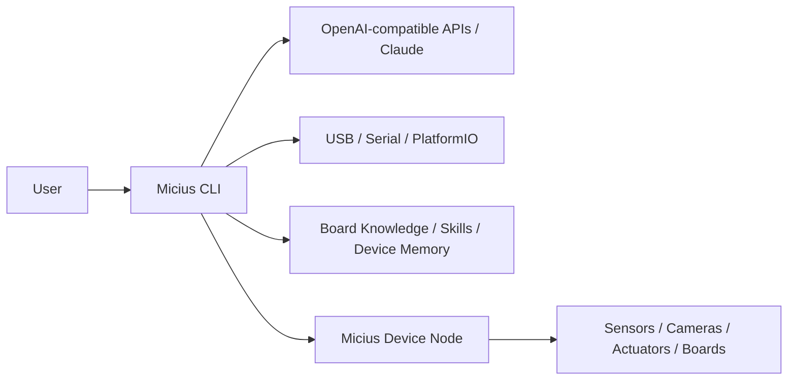

# Micius-Agent

[](LICENSE)
[](https://www.python.org/)
[](#status)

Language: English | [中文](README_CN.md)

**A terminal-first embedded agent that lets LLMs see, remember, and operate real-world devices.**

Terminal-first embedded agent workbench for OpenAI-compatible APIs, native Anthropic Claude, local development tools, serial devices, cameras, ESP32-class boards, and Linux-capable edge nodes.

The name **Micius** refers to **Mozi (墨子)**, the ancient Chinese thinker whose work is associated with logic, engineering, optics, and practical craftsmanship.

Micius-Agent keeps the main agent on your computer and exposes connected hardware through controlled tools and lightweight device nodes. This makes it useful for development boards that cannot run a full coding agent locally.

## Try It In 60 Seconds

No API key or hardware is required for the first smoke test:

```bash
git clone https://github.com/Dryoung95/micius.git
cd micius
python -m pip install -e .
micius demo
```

Expected demo output:

```text
Micius demo
-----------
Local mode: OK
Device node status: not connected; this is fine for a first no-hardware test.

No-hardware commands to try inside Micius:
  /doctor
  /usb
  /board list
  /model
  /commands
```

## Why Micius?

Most coding agents live inside files and terminals. Micius is designed for the physical edge:

- It can scan USB and serial devices.
- It can monitor bounded serial output.
- It can build and upload PlatformIO firmware.
- It can connect Linux-capable boards as lightweight device nodes.
- It can remember board profiles, port aliases, failed attempts, working commands, and reusable hardware workflows.

## Architecture



## Highlights

- **Flexible model config**: use OpenAI-compatible APIs or the native Anthropic Claude Messages API.
- **Terminal-first workflow**: launch with `micius`, then use natural language or slash commands.
- **Local hardware tools**: scan USB, monitor serial ports, install allowlisted dependencies, build and upload PlatformIO projects.
- **Device-node bridge**: connect Linux-capable boards through a lightweight JSONL TCP tool server.
- **DeviceResearch traces**: record bring-up tasks as `task.json`, `plan.md`, and `trace.jsonl`.
- **Persistent skills and board knowledge**: store reusable workflows, port maps, manual summaries, and device lessons.
- **Context-aware agent loop**: compact large tool results, store artifacts, and expose estimated token/cost telemetry.
- **Conservative tool boundary**: no unrestricted shell execution by default.

## Status

Micius-Agent is an early prototype. APIs, command names, file layouts, and hardware workflows may change before a stable release.

Current focus:

- local CLI experience
- ESP32 and PlatformIO workflows
- Linux-capable embedded device nodes
- board knowledge and skill curation
- traceable hardware bring-up

## Installation

Requirements:

- Python 3.10+
- A UTF-8 capable terminal
- An OpenAI-compatible API endpoint or an Anthropic Claude API key
- Optional for ESP32 workflows: `pyserial`, `esptool`, `platformio`

```bash
git clone https://github.com/Dryoung95/micius.git
cd micius
python -m pip install -e .
```

Configure your model:

```bash
micius --setup
```

You can also use the command-style shortcut:

```bash
micius setup
```

The setup wizard supports:

- `provider: "openai"` for OpenAI-compatible endpoints such as OpenAI, DeepSeek-compatible gateways, or other `/v1/chat/completions` services.
- `provider: "anthropic"` for native Claude through Anthropic's `/v1/messages` API, including Claude tool use.

Example native Claude config:

```json
{
  "llm": {
    "provider": "anthropic",
    "base_url": "https://api.anthropic.com/v1",
    "model": "claude-sonnet-4-5",
    "api_key_env": "ANTHROPIC_API_KEY",
    "anthropic_version": "2023-06-01"
  }
}
```

Start the CLI:

```bash
micius
```

Expected startup:

```text
Micius-Agent v0.1
Embedded Agent Workbench for general embedded devices
micius>
```

If you see `Welcome to Codex, OpenAI's command-line coding agent`, you started OpenAI Codex CLI instead of Micius. Return to this repository directory and run `micius` or `python -m local_agent.cli`.

You can also copy `configs/local_agent.example.json` to `configs/local_agent.json` and edit it manually. Do not commit `configs/local_agent.json`.

## No-Hardware Check

Micius should still be useful before a board is connected:

```bash
micius demo
micius doctor
```

`micius demo` confirms that the CLI, config, local tools, and no-hardware path are installed. `micius doctor` prints a JSON diagnostic report. Use `micius doctor api` when you also want to test the configured model endpoint.

## Quick Start

Inside the Micius terminal:

```text
/usb
/deps install platformio
/pio devices
/pio build local_agent/esp32_blink
/pio upload local_agent/esp32_blink COM6
/serial monitor COM6 115200 5
```

Replace `COM6` with the port shown by `/usb` or `/pio devices`.

## Core Commands

| Command | Purpose |
|---|---|
| `micius demo` | Run a no-hardware installation demo. |
| `micius doctor [api]` | Run non-interactive local diagnostics. |
| `/setup` | Configure provider, API URL, model, and key. |
| `/model` | Show the active provider, model, and endpoint. |
| `/model list` | List models exposed by the configured API. |
| `/cost` | Show estimated prompt tokens, provider usage, and compaction savings. |
| `/permissions` | Show tool risk classes and compaction policies. |
| `/context budget` | Inspect message/context sizes and the context ledger. |
| `/usb` | Scan USB devices and serial ports. |
| `/serial monitor <port> [baud] [seconds]` | Read bounded serial output. |
| `/deps install platformio` | Install an allowlisted local dependency. |
| `/pio devices` | List PlatformIO-visible devices. |
| `/pio build <project>` | Build a PlatformIO project. |
| `/pio upload <project> <port>` | Upload firmware with PlatformIO. |
| `/research new <goal>` | Start a traceable hardware workflow. |
| `/research scan <task_id>` | Attach USB and device-node evidence. |
| `/research skill <task_id> <name>` | Distill a task trace into a workflow skill. |
| `/report [email]` | Generate a redacted diagnostic report. |
| `/restart` | Restart the CLI and reload source/config. |

Run `/commands` inside Micius for the full command palette.

## Provider Templates

Provider snippets live in `configs/providers/`:

| Template | Use case |
|---|---|
| `openai-compatible.example.json` | OpenAI-compatible `/v1/chat/completions` gateways. |
| `anthropic-claude.example.json` | Native Anthropic Claude `/v1/messages` API. |
| `deepseek-compatible.example.json` | DeepSeek's OpenAI-compatible API. |

Copy the `llm` section you need into `configs/local_agent.json`, or run `micius --setup`.

## Agent Loop

Micius keeps a lightweight context ledger for long hardware sessions:

- Large serial logs, PlatformIO output, diagnostic reports, and camera payloads are written to `data/tool_artifacts/`.
- The model receives a compact summary plus the artifact path instead of repeated full logs.
- Tool policies record risk class, parallel-safety, and compaction behavior.
- `/cost`, `/permissions`, and `/context budget` expose the current loop state.

This is the first step toward a cache-stable, cost-aware loop for long-running embedded workflows.

## DeviceResearch

DeviceResearch turns hardware bring-up into a resumable workflow:

```text
/research new bring up an ESP32 board and verify serial output
/research scan <task_id>
/research pio <task_id> build local_agent/esp32_blink
/research pio <task_id> upload local_agent/esp32_blink COM6
/research serial <task_id> COM6 115200 5
/research skill <task_id> esp32_blink_bringup
```

Each task writes:

```text
data/device_research/<task_id>/
|- task.json
|- plan.md
\- trace.jsonl
```

See [docs/DeviceResearch.md](docs/DeviceResearch.md) for the design.

## Device Nodes

For Linux-capable boards, run the lightweight device-node server on the board:

```bash
python -m micius_device_node.server --host 0.0.0.0 --port 8765
```

Then configure `configs/local_agent.json` so `device_node.host` points to the board IP and run:

```text
/connect doctor
/resources
/peripheral list
/script list
```

The package still contains the legacy `atlas_agent` module name because the first prototype targeted Atlas-class hardware. New documentation and generated commands use the generic `micius_device_node` module and the public `micius-device-node` command.

## Board Knowledge

Board knowledge lives under `board_knowledge/`:

| Directory | Purpose |
|---|---|
| `boards/` | Structured board profiles, port aliases, and peripheral facts. |
| `skills/` | Concise agent-facing board skills. |
| `manuals/` | Imported manual summaries. |
| `templates/` | Board profile templates. |
| `schemas/` | JSON schemas for profile validation. |

The goal is to build durable device memory: connected peripherals, port names, safe actions, reusable scripts, and lessons from previous bring-up sessions.

## Project Layout

```text
local_agent/        CLI, model client, local tools, memory, DeviceResearch
micius_device_node/ Generic embedded device-node entry point
atlas_agent/        Legacy implementation kept for compatibility
shared/             JSONL RPC protocol helpers
board_knowledge/    Board profiles, manual summaries, and skills
configs/            Example local configuration files
docs/               Design notes
micius_memory/      Runtime memory templates and workflow skill storage
data/               Runtime reports and traces, ignored except .gitkeep
```

## Safety Model

Micius-Agent keeps risky operations behind explicit tools:

- API keys live in local config or environment variables and are ignored by git.
- Dependency installation is allowlisted.
- PlatformIO operations are restricted to project directories with `platformio.ini`.
- Serial monitoring is bounded by duration and byte limits.
- DeviceResearch records evidence before claiming hardware success.
- Runtime reports redact common secrets before writing support bundles.

## Roadmap

- Broader ESP32 and MCU templates
- Safer firmware-generation workflows
- Board manual import and profile validation
- Device-node installers for common Linux boards
- Stronger skill curation from repeated hardware workflows
- CI checks for package metadata and example projects

## Community and Feedback

Micius-Agent is looking for early testers and contributors.

You are welcome to:

- try Micius-Agent with your own embedded boards and peripherals
- submit issues with hardware bring-up logs or usability feedback
- open pull requests for tools, board profiles, examples, docs, and bug fixes
- propose logo, mascot, terminal UI, or brand design ideas

For bug reports, run `/report` and attach the redacted output when possible.

For feedback, collaboration, or logo design proposals, contact:

```text
3241347200@qq.com
```

Before opening a pull request:

```bash
python -m py_compile local_agent/agent.py local_agent/cli.py local_agent/self_tools.py local_agent/device_research.py
```

## License

Micius-Agent is released under the [Apache License 2.0](LICENSE).
